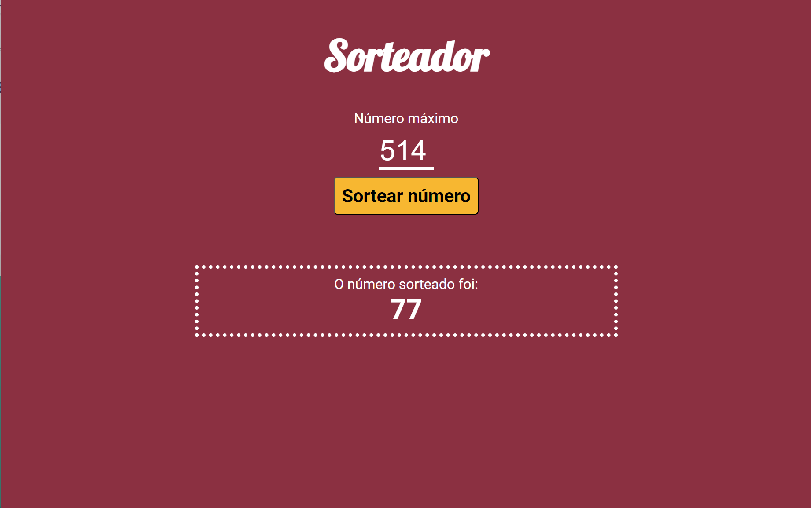

# Random number picker - Grunt


This application serves as a random number picker where users can select their desired maximum value, and the app generates a random number within that range. It was styled using LESS, scripted with DOM, and automated tasks with Grunt.

## Index
- <a href="#functionalities">Application functionalities</a>
- <a href="#layout">Layout</a>
- <a href="#demonstration">Demonstration</a>
- <a href="#run">How to run the application</a>
- <a href="#tecnologies-used">Tecnologies used</a>
- <a href="#developer">Developer</a>

## Application functionalities
 - [x]  Random number picker
 - [x]  Interactive message

## Layout



## Demonstration
[Link (deploy)](https://random-number-picker-grunt.vercel.app/)


## How to run the application
```bash
# Clone this repository
$ git clone repolink

# Acess the app folder on your terminal
$ cd random-number-picker-grunt

# Install the dependencies
$ npm install

# Utilize a local server launch tool to view the application in your browser

```

## Tecnologies used
1. HTML
2. LESS
3. Javascript
4. DOM
5. Grunt

## Developer
[LinkedIn](https://www.linkedin.com/in/julia-silva-borges/)
